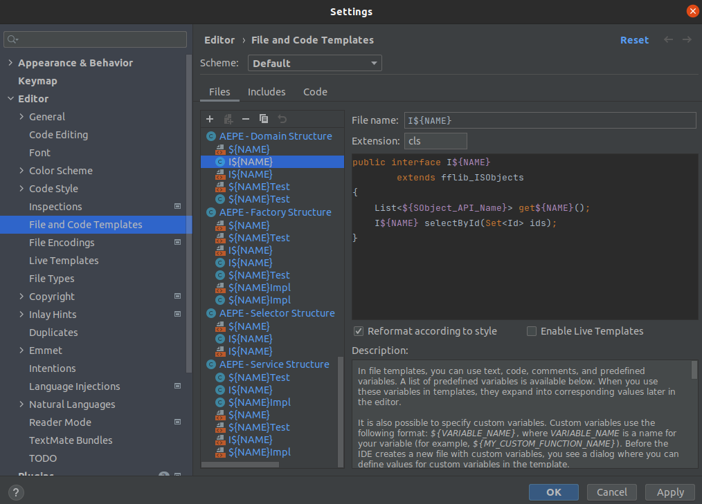

# JetBrains Assets Installation guide

1. Find your [local configuration folder](https://www.jetbrains.com/help/idea/directories-used-by-the-ide-to-store-settings-caches-plugins-and-logs.html#config-directory), which is different for each system. 
<br/> Use a file explorer to find the exact sub-folder name and copy the full path


2. Make a local copy of this repository. <br/>
Open a terminal and execute the following in a temporary folder
```bash
git clone https://github.com/wimvelzeboer/fflib-apex-extensions.git
```
3. Now copy the fileTemplates to the configuration folder
```bash
cp -R cp ./fflib-apex-extensions/dev-tools/assets/intelliJ/fileTemplates ~/.config/JetBrains/WebStorm2021.3/ 
``` 
4. Restart IntelliJ / Webstorm (or which ever Jetbrains tool you are using)

5. Go to Preferences (or File->Settings in Linux) and search for "file and code templates", 
<br/> Scroll all the way down and double check if all the file names of the have their proper name. 
<br/> If not, then add the right name in the filename field (FOR ONLY THE CHILD FILES!!)

